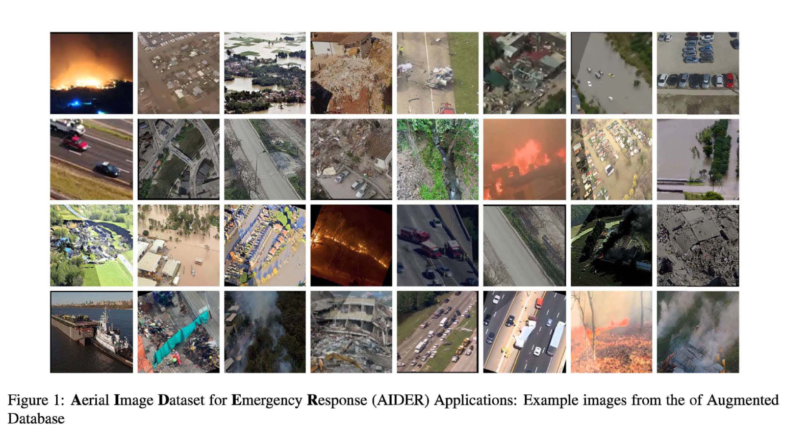
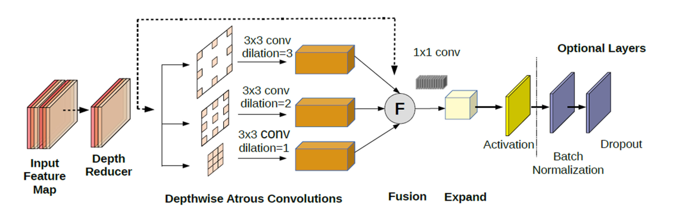

# Disaster Detection For Disaster Management From Aerial Imagery

This repository proposes a method for real time disaster detection and classification using state of the art deep learning techniques. We have used a emergency response dataset referred as [Aerial Imagery Dataset for Emergency Response - AIDER ](https://zenodo.org/record/3888300#.YK94M6gzY2w) for training our deep learning models.

## Aerial Imagery Dataset for Emergency Response
 It can be downloaded from [Zenodo](https://zenodo.org/record/3888300) or [Google Drive.](https://drive.google.com/file/d/1EUQ8BiTRn-ePsOUoB2WAPMAI9egbvtY-/view?usp=sharing)


## Architecture
 We present two improved version of EmergencyNet architecture based on IEEE 2020 Paper  [EmergencyNet: Efficient Aerial Image Classification for Drone-Based Emergency Monitoring Using Atrous Convolutional Feature Fusion](https://ieeexplore.ieee.org/abstract/document/9050881)
 - Squeeze ErNET 
 - Squeeze ErNET RedConv
 
### Atrous Convolution Feature Fusion (ACFF) Block 


## Inference
To run real time inference on your webcam stream use  `real-time-inference.py`
```
python real-time-inference.py --model {model} --weights weights/{model.pt}
```
To run inference on image of your choice use `aider-predict.py`
```
python aider-predict.py --model {model} --weights weights/{model.pt} --image path/to/image
```

### TensorRT Inference
TensorRT takes the network definition, performs optimizations including platform-specific optimizations, layer optimizations and generates the inference engine. 
To optimize a model for TensorRT inference add `--trt flag` 

### Quantized Inference 
Reduced precision networks tends to process faster without a significant loss in accuracy. To accelerate the inference we offer three quantization schemes for inference on
TensorRT.
- fp32
- fp16
- int8

The default quantization scheme is fp16. 
Add `--quant quant-scheme` flag for quantized inference

## Training
For training models use `train.py` 
```
python train.py --model {model} --root path/to/data 
```
For training on Google colab add `--collab` flag 

## Evaluate
You can evaluate performance of Pytorch models and their TensorRT engines on basis of their accuracy, F1 score and fps. 
To evaluate the models you can use `evaluate-classification-metrics.py` script
```
python evaluate-classification-metrics.py --model {mode} --weights weights/{model.pt} --root-dir path/to/data 
```
Add `--trt` and `--state path/to/pth/file` flags for evaluating TensorRT engine's performance

## Power Consumption
Power usage of model on Nvidia Jetson TX2 can be calculated using `calculate-power-usage.py` script
```
python calculate-power-usage.py --model {model} --weights weights/{model.pt} --root-dir path/to/data 
```
power usage script will give power trace graphs which are further used to estimate energy per frame for each model.

## Code Organization
The implementation in this repository is organized as following levels:
- **dataloaders:** contains the dataloader and transformations for AIDER
- **model:** contains the implementation of two different architectures squeeze ernet and squeeze ernet reduced conv 
- **model summary:** contains the architecture summary of implementated models
- **onnx:** contains the onnx files for implemented models
- **power usage plots:** contains the power consumption traces for implemented models in different quantization schemes
- **resources:** contains readme resources 
- **tensorrt state dicts** contain state dicts for TensorRT models 
- **weights** contains pretrained weights for implemented models

